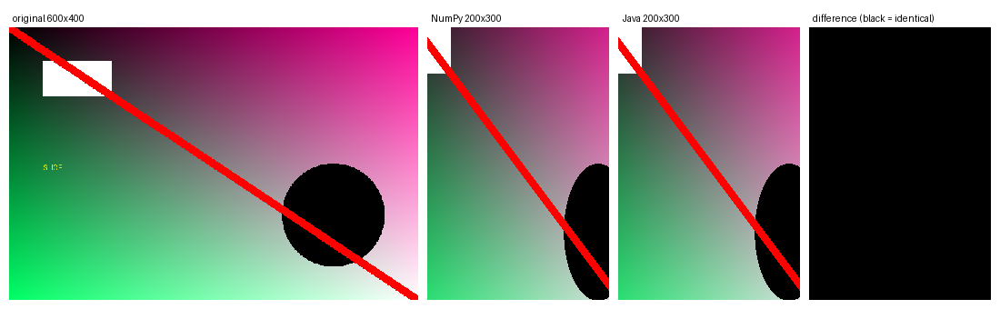
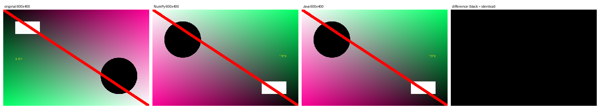
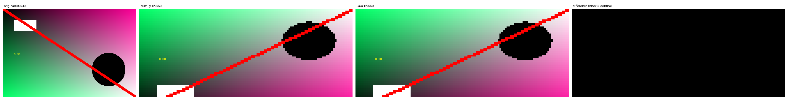

# Task 4: 2D Matrix Slicing in NumPy and Java

## 1. Goal

Implement 2D slicing (`matrix[rows, cols]` with `start:stop:step` ranges) in NumPy and in Java, apply both to a real image, and show that the two implementations give the same result.

An image is a good test matrix: a slice is a crop (or a subsample, or a flip), and any indexing mistake is visible. Each pixel is one matrix element (RGBA, 4 channels), so the slice is applied to the height×width grid and the channels are carried along.

## 2. Repository layout

```
task4/
├── README.md
├── results/                     # comparison figures used in this report
└── code/
    ├── Java/src/ada/slicing/
    │   ├── Range.java           # parses and resolves "start:stop:step"
    │   ├── Slicer.java          # the 2D slicing algorithm
    │   └── Main.java            # CLI: reads image, slices, writes PNG
    ├── Python/slicer.py         # NumPy slicer (CLI)
    ├── generate_image.py        # creates a test image of any size
    └── demo.py                  # runs both, checks equality, draws the figure
```

## 3. Implementation

**NumPy.** `matrix[rows, cols]` with two `slice` objects built from the text ranges. The result is copied so it does not share memory with the source.

**Java.** NumPy has no counterpart in plain Java, so slicing is written by hand and has to reproduce NumPy's rules exactly:

- `Range.parse` turns `start:stop[:step]` into resolved integers using the same semantics as Python: every part optional, negative indices count from the end, out-of-range bounds are clamped, a negative step walks backwards (defaults then become `length-1` and "before index 0"), and step 0 is an error.
- `Range.size` computes the number of selected indices (ceiling division, never negative).
- `Slicer.slice` allocates the output matrix of that size and copies `out[i][j] = m[r][c]`, advancing `r` and `c` by the steps. Cost is O(output size).

**No hard-coded values.** The image path, both ranges and the output path are command-line arguments; image and slice sizes can be anything. Invalid input (unreadable image, malformed range, zero step, empty selection) prints an error and exits with status 1.

## 4. How to run

Requirements: JDK 17+ (tested with 25), Python 3 with `numpy` and `Pillow` (`pip install numpy pillow`).

```bash
cd task4/code

# generate a test image, run both implementations, compare, and draw the figure
python demo.py --size 600x400 --rows=50:350 --cols=100:500:2 --name crop

# use your own image
python demo.py --image photo.png --rows=::2 --cols=::2 --name half

# each implementation separately
python Python/slicer.py input.png out_numpy.png --rows=50:350 --cols=100:500:2
javac -d Java/out Java/src/ada/slicing/*.java
java -cp Java/out ada.slicing.Main input.png 50:350 100:500:2 out_java.png
```

Use the `--rows=VALUE` form (with `=`) so values starting with `-` are not read as options. `demo.py` writes everything into `code/output/` and exits with status 0 only if the two results are identical.

## 5. Verification

`demo.py` loads both output PNGs and compares them pixel by pixel (`numpy.array_equal` on the RGBA arrays); the last panel of each figure shows their difference. Test image: 600×400, with a gradient, a white box (top-left), a black disc (bottom-right), a red diagonal and text, so that crops, flips and strides are easy to recognise.

| Case | rows | cols | Result size (H×W) | NumPy = Java |
|---|---|---|---|---|
| crop + stride | `50:350` | `100:500:2` | 300×200 | identical |
| flip both axes | `::-1` | `::-1` | 400×600 | identical |
| negative indices | `-100:-10` | `20:-20:3` | 90×187 | identical |
| backward stride | `500:50:-7` | `::5` | 50×120 | identical |
| out-of-range bounds | `10:9999` | `-9999:50` | 390×50 | identical |
| vertical flip | `-1:-401:-1` | `::1` | 400×600 | identical |
| single pixel | `0:1` | `0:1` | 1×1 | identical |

Error cases behave the same way in both programs: an empty slice (`5:5`) and a zero step (`0:10:0`) are rejected with a message.

### Figures

Each figure shows: the original, the NumPy result, the Java result, and the difference (all black = identical). Panels are scaled to the same height for display.

Crop with column stride 2 (`--rows=50:350 --cols=100:500:2`):



Flip on both axes (`::-1`, `::-1`):



Backward stride with out-of-range start (`500:50:-7`, `::5`):



## 6. Test on a real image

Besides the generated test image, both programs were run on a real image, a 2500×2500 PNG of an old computer on a green background (`computer.png`, not included in the repository because of its size).

| Case | rows | cols | Result size (H×W) | NumPy = Java |
|---|---|---|---|---|
| crop the monitor | `300:1500` | `400:1700` | 1200×1300 | identical |
| subsample | `::5` | `::5` | 500×500 | identical |
| vertical flip | `::-1` | `::1` | 2500×2500 | identical |


**Transparency.** The first attempt, `--rows=100:400 --cols=50:300`, selected only the top-left corner of the image, which is plain background. Both programs returned the same 300×250 patch, but the standalone output files looked white in the image viewer. Checking the pixels showed that every pixel was (71, 112, 76) with alpha 0: the source PNG has a transparent background, and slicing preserves the alpha channel. The comparison figure ignores alpha, so it shows the green colour underneath. The outputs were correct. The lesson is that the slice must be chosen to cover the object of interest, and that the programs handle all four RGBA channels, not only colour.

## 7. Discussion

- The NumPy version is one expression; the Java version needs about 80 lines, mostly to reproduce the bounds rules (clamping, negative indices, negative steps). Those rules are where the bugs are, which is why the test cases above are concentrated on them.
- NumPy basic slicing returns a *view* (no copy). The Java version always copies. Both programs copy in the end, because the result is written to a file, so the outputs are comparable.
- The comparison is exact (integer pixels, no arithmetic), so "identical" means every RGBA value matches, not "close".

